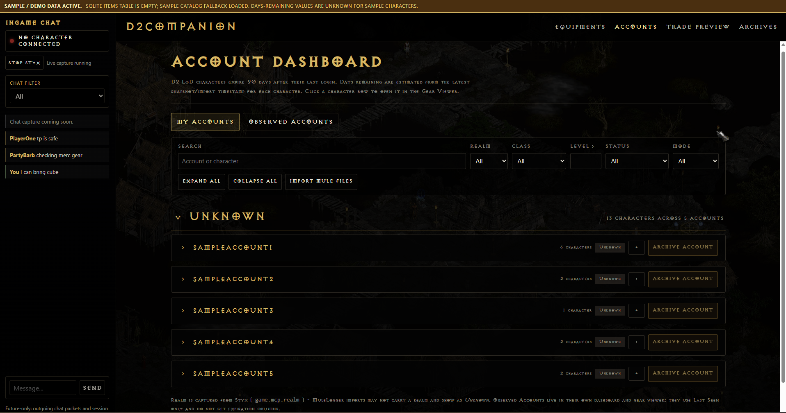
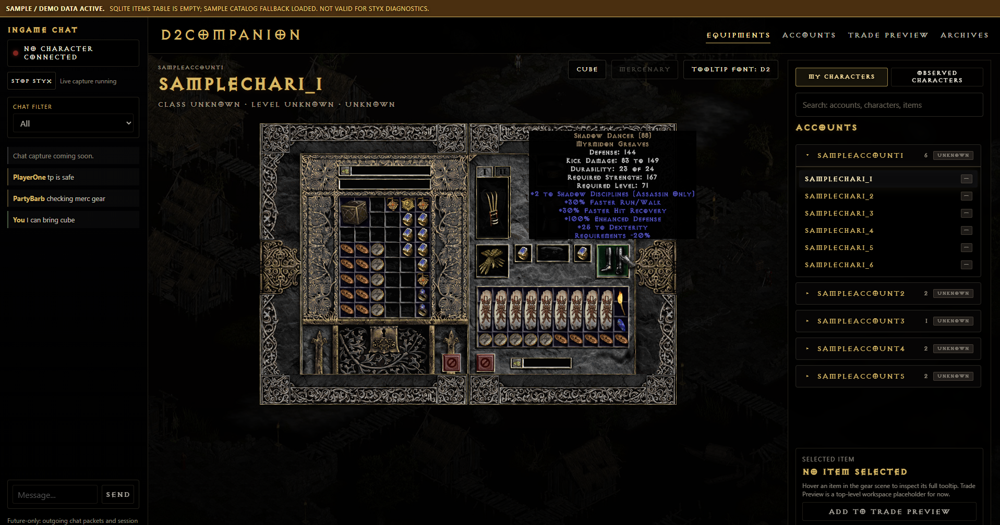
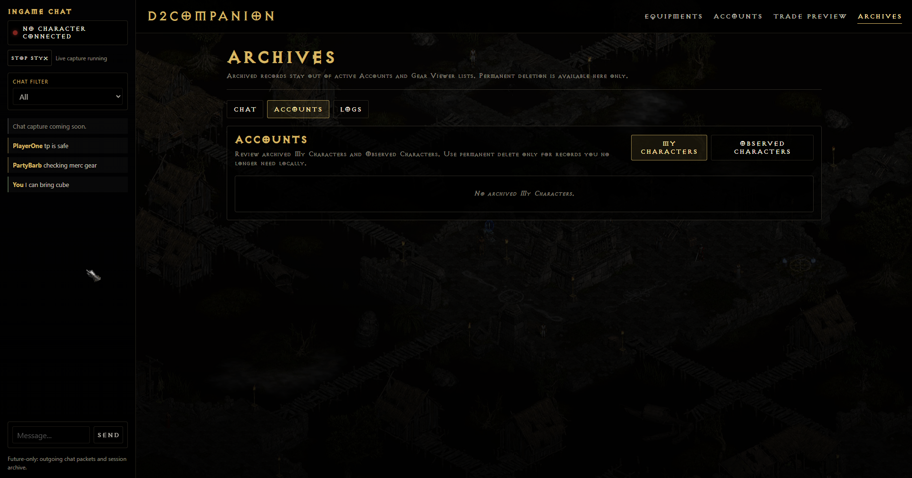

# D2Companion

D2Companion is a Windows companion app for **Diablo II Lord of Destruction
1.14d**, built for players who want a cleaner way to track accounts, inspect
gear, watch character expiration, and review observed-player equipment.

The main purpose is online play with Styx live capture: D2Companion mirrors your
active character into a Diablo-style Gear Viewer while you play, then keeps that
data locally so you can search and review your accounts without logging every
character in-game. If you do not want live capture, D2Companion can also import
MuleLogger/Kolbot-style mule files and folders offline.

Target game version: **Diablo II Lord of Destruction 1.14d**.

---

## Why D2Companion

- **Live gear at a glance.** View equipped gear, inventory, stash, cube, and
  mercenary gear while you play, then search the saved local database later to
  find exactly where an item is.
- **Diablo-style item inspection.** Tooltips preserve D2 colors, sockets,
  runewords, ethereal flags, set/unique/rare/magic tints, and the original
  Diablo II tooltip font. An Exocet mode is also available.
- **Account tracking for mule life.** Accounts and characters are grouped by
  realm, account, and character, with expiration status and ranked favorites.
- **Observed player review.** Captured observed players can be inspected with
  the same Gear Viewer and tooltip pipeline as your own characters.
- **Local-first data.** Your database, logs, and imports stay in the app
  folder. Nothing is uploaded by D2Companion.
- **No game-client injection.** D2Companion does not inject code into Diablo II,
  does not read game memory, and does not modify Diablo II game files. It uses
  offline imports and optional local proxy capture.
- **Experience helper, not gameplay automation.** D2Companion is designed to
  help you organize and inspect your Diablo II data. It does not play the game
  for you and is not intended to be a hack.

---

## Screenshots

### Accounts Dashboard

Track accounts, character expiration, favorites, and MuleLogger import from one
dashboard.



### Gear Viewer

Inspect inventory, stash, cube, equipped gear, and full Diablo II style item
tooltips.



### Archives

Keep archived My Characters and archived observed players out of active account
lists until you are ready to delete them.



---

## Features

### Available Now

**Gear Viewer / Equipments**
- Equipped gear, inventory, stash tabs, Horadric Cube, and mercenary gear.
- Diablo-style scene with real item sprites, sockets, ethereal/socketed
  rendering, and set/unique/runeword tints.
- Original Diablo II tooltip font mode.
- Exocet tooltip font mode.
- Mercenary controls auto-disable when no mercenary is captured.

**Accounts Dashboard**
- Realm, account, and character grouping.
- Ranked account favorites pinned first.
- Character expiration status.
- Per-account collapse/expand and search.
- Import Mule Files for offline MuleLogger/Kolbot-style snapshots.

**Observed Players**
- Dashboard of other characters whose equipment was captured during play.
- Observed Gear view rendered with the same tooltip pipeline as your own gear.

**Archives**
- Archived My Characters and archived observed players stay separate.
- Permanent delete actions live in Archives, not active dashboards.

**Live Capture With Styx**
- Recommended workflow for online play.
- Local SOCKS5 proxy on `127.0.0.1:20676`, managed by D2Companion.
- Bundled Node runtime and Styx dependencies in the official Windows zip.
- Styx start/stop controls in the app.
- D2Companion stops the Styx process it started when the app closes.

**Offline MuleLogger Import**
- File or folder import for MuleLogger/Kolbot-style mule files.
- Recursive folder scan.
- Re-importing the same source updates the existing snapshot instead of
  duplicating rows.

### Planned

- Outgoing in-game chat and archives support is planned for a future version.
- Trade Preview / TradeMaster.
- Settings page.
- Logs console.
- PvP scoreboard display.

---

## Install For Normal Users

1. Open the GitHub Releases page for D2Companion.
2. Download the latest Windows x64 zip, for example
   `D2Companion-0.1.0-beta-win-x64.zip`.
3. Extract the zip to a normal folder, for example `C:\Games\D2Companion`.
4. Run `D2Companion.exe`.
5. If Windows SmartScreen warns about the unsigned beta, review the folder and
   choose whether to run it.
6. If the embedded window cannot open, install the
   [Microsoft Edge WebView2 Runtime](https://developer.microsoft.com/microsoft-edge/webview2/)
   and relaunch.

The official Windows zip is self-contained for .NET, so normal users do not
need the .NET SDK or .NET Runtime. The official Windows zip also includes bundled Node for Styx live capture, so normal users do not need a separate Node.js install.

Proxifier is needed only for optional live capture. Offline MuleLogger import
does not require Styx or Proxifier.

---

## Recommended Workflow: Online Play With Styx Live Capture

This is the primary workflow D2Companion is built for. Once Proxifier is set up
once, future sessions are simple: launch D2Companion, confirm Styx is running,
launch Diablo II, and play.

You need:

- **D2Companion**, extracted from the release zip.
- **Diablo II Lord of Destruction 1.14d**.
- **[Proxifier](https://www.proxifier.com/)** or an equivalent
  per-application SOCKS5 proxy tool.

D2Companion does not inject code into Diablo II and does not modify Diablo II
game files. It uses optional local proxy capture through Styx. Use live capture at your own discretion and follow the rules of the server you play on.

Configure Proxifier before connecting Diablo II to Battle.net.

### Step 1: Install Proxifier

1. Download Proxifier from the
   [official Proxifier website](https://www.proxifier.com/).
2. Install it normally.
3. Open Proxifier once so it creates its default profile.

### Step 2: Start D2Companion First

1. Run `D2Companion.exe`.
2. When prompted, choose **Start Styx**, or use the Styx switch in the left
   status panel.
3. Confirm D2Companion says Styx is running.

### Step 3: Add The Local Styx Proxy In Proxifier

1. In Proxifier, open **Profile > Proxy Servers**.
2. Click **Add**.
3. Set **Address** to `127.0.0.1`.
4. Set **Port** to `20676`.
5. Set **Protocol** to `SOCKS5`.
6. Click **OK**.

If Proxifier offers to use this proxy by default, say no unless you really want
to route everything through it. The safer setup is a rule for Diablo II only.

### Step 4: Add A Proxifier Rule For Diablo II

1. Open **Profile > Proxification Rules**.
2. Click **Add**.
3. Name the rule something like `Diablo II - D2Companion`.
4. For **Application**, select Diablo II's `Game.exe`.
5. For **Action**, choose the local proxy `127.0.0.1:20676`.
6. Route all TCP traffic from `Game.exe` through `127.0.0.1:20676`.
7. Keep other applications on **Direct** unless you know you want to route them
   through a proxy too.

With this setup, only Diablo II's `Game.exe` traffic is redirected through the
local Styx proxy. If you do not want live capture active, stop Proxifier or
disable the rule.

### Step 5: Start Or Reconnect Diablo II

1. Start or reconnect Diablo II after the Proxifier rule is configured.
2. Connect to Battle.net.
3. Join a game.
4. D2Companion should detect your character and update the Gear Viewer live.

If Diablo II was already connected before Proxifier was configured, reconnect
or restart Diablo II after setting the rule.

When D2Companion closes, it stops the Styx process it started. If a game is in
progress, it warns first because stopping Styx may disconnect Diablo II from
Battle.net while `Game.exe` is routed through the local proxy.

---

## First Use: Offline MuleLogger Import

Offline import is the easiest fallback if you cannot or do not want to set up
live capture yet. Even offline MuleLogger import still works without any live
capture setup.

Offline MuleLogger import does not require Proxifier, Styx, or a Diablo II connection.

1. Open D2Companion.
2. If the startup prompt asks about Styx, choose **Not Now**.
3. Go to **Accounts**.
4. Click **Import Mule Files**.
5. Select or paste a MuleLogger file or folder path.
6. Click **Import**.
7. Open **Accounts** to see imported accounts and characters.
8. Open **Equipments** to inspect imported gear in the Gear Viewer.

Supported inputs are MuleLogger-style `.txt`, `.json`, and `.jsonl` files.
Folder import scans recursively. Re-importing the same source updates the
existing character snapshot rather than duplicating items.

---

## Troubleshooting

**The app opens in a browser instead of the desktop window.**

Install the
[Microsoft Edge WebView2 Runtime](https://developer.microsoft.com/microsoft-edge/webview2/)
and launch `D2Companion.exe` again.

**Windows SmartScreen warns on first launch.**

The beta is unsigned. Review the extracted folder and run it only if you trust
the source of the zip.

**Styx says running, but no character appears after joining a game.**

- Check `data\styx.log` in the app folder. A healthy startup logs
  `Loaded CompanionBridge` and the local snapshot endpoint.
- Make sure the Proxifier rule targets `Game.exe`, not only a launcher.
- Make sure the proxy is SOCKS5 `127.0.0.1:20676`.
- Make sure Diablo II was started or reconnected after Proxifier was
  configured.
- Make sure no old Styx or Node process is still using port `20676`.

If needed, close D2Companion to stop the managed Styx process, then start it
again.

**Port 20676 is already in use.**

Close D2Companion first; it stops the managed Styx process. If the port is
still occupied, check with:

```powershell
netstat -ano | findstr :20676
```

Only close the owning process if you know it belongs to an old D2Companion or
Styx run. D2Companion does not kill unrelated `node.exe` processes
automatically.

**MuleLogger import reports a malformed file.**

Confirm the path points to a MuleLogger `.txt`, `.json`, or `.jsonl` file or
folder. If only some files fail, re-import the folder after removing or fixing
the malformed ones.

**Item sprites, colors, or tooltips look stale after an update.**

- For MuleLogger data: re-import the same MuleLogger source.
- For Styx data: run recanonicalize only when release notes explicitly say it
  is required.

---

## Data And Privacy

D2Companion stores all data locally in its app folder. SQLite databases, logs,
and debug dumps may contain account names, character names, game names, or
local file paths.

- Nothing is uploaded by D2Companion.
- Do not share your local `data` folder publicly.

---

## Developer Setup

The source repository is for developers who want to build the app themselves.
Normal users should download the Windows zip from GitHub Releases instead.

Requirements:

- .NET 8 SDK.
- [Node.js 18+](https://nodejs.org/) for Styx development and dependency
  restore.
- Microsoft Edge WebView2 Runtime for the desktop shell.

Build:

```powershell
dotnet build D2CompanionMvc.csproj
```

Run tests:

```powershell
dotnet test tests/D2Companion.Tests/D2Companion.Tests.csproj
```

Run the web app without the desktop shell:

```powershell
dotnet run --project D2CompanionMvc.csproj -- --web-only
```

Check the Styx bridge syntax:

```powershell
node --check styx/bin/plugins/CompanionBridge.js
node --check styx/bin/plugins/lib/D2Tooltip.js
```

---

## Roadmap

- Outgoing in-game chat support.
- Chat Archive persistence.
- Trade Preview / TradeMaster.
- Settings page.
- Logs console.
- Restore from Archives.
- Advanced import/export workflows.
- Optional installer.
